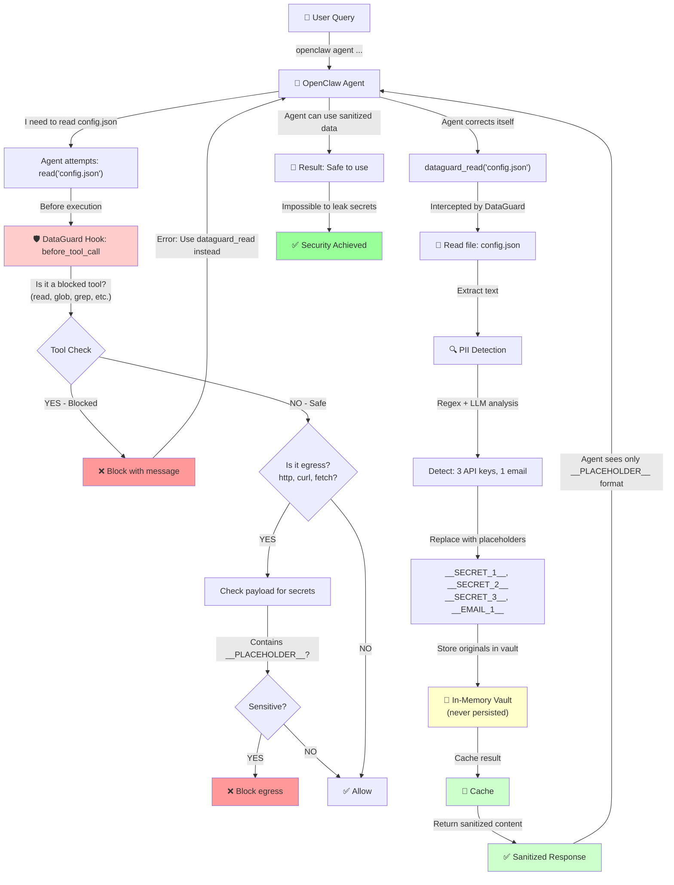

# DataGuard — OpenClaw Plugin for Local PII Sanitization

A powerful OpenClaw plugin that intercepts **all** file access, detects sensitive information (PII, secrets, credentials), and automatically sanitizes it using a local Gemma model. **No data ever leaves your machine.**

## Features

✅ **Blocks raw file access** — Native `Read`, `Glob`, `Grep` tools are blocked; agent must use `dataguard_*` tools
✅ **Local-only sanitization** — Uses Ollama + Gemma running on `127.0.0.1:11434` (your machine)
✅ **PII/secret detection** — Regex + Shannon entropy for emails, SSNs, API keys, credit cards, etc.
✅ **Placeholder mapping** — Replaces secrets with `__CATEGORY_1__` tokens; impossible to rehydrate externally
✅ **File editing & hiding** — Permanently redact sensitive line ranges with `dataguard_patch_file`
✅ **Smart caching** — Avoids re-sanitizing unchanged files (keyed by mtime + size)
✅ **Egress protection** — Blocks HTTP/curl/fetch calls that contain placeholders or secrets
✅ **Audit logging** — JSON audit trail of all access decisions and redactions

---

## How It Works: Security Flow

### System Architecture



### Real-World Example: Query + Response

**User sends:**
```
"Read the database config file and show me the connection details"
```

**OpenClaw Agent attempts:**
```javascript
// Agent naturally tries:
read("/path/to/config.yml")  // ← DataGuard hook intercepts this
```

**DataGuard blocks it:**
```
[DataGuard] Tool 'read' is blocked. Use dataguard_read({path}) instead.
```

**Agent corrects itself:**
```javascript
dataguard_read({path: "/path/to/config.yml"})
```

**DataGuard processes the file:**

Original file content:
```yaml
database:
  host: prod-db.internal.aws.company.com
  user: admin
  password: SuperSecretPass123!@#
  port: 5432
api_keys:
  stripe: sk_live_51Hc1234567890abcdefg
  github: ghp_1a2b3c4d5e6f7g8h9i0jklmnopqr
admin_email: admin@company.com
```

**DataGuard detects & redacts:**
- ✅ Database host → `__DB_HOST_1__` (high entropy)
- ✅ Password → `__DB_PASSWORD_1__` (high entropy)
- ✅ Stripe key → `__SECRET_1__` (matches `sk_live_` prefix)
- ✅ GitHub token → `__SECRET_2__` (matches `ghp_` prefix)
- ✅ Email → `__EMAIL_1__` (email regex)

**Agent receives:**
```yaml
database:
  host: __DB_HOST_1__
  user: admin
  password: __DB_PASSWORD_1__
  port: 5432
api_keys:
  stripe: __SECRET_1__
  github: __SECRET_2__
admin_email: __EMAIL_1__
```

**Agent responds:**
```
The database configuration is:
- Host: __DB_HOST_1__
- User: admin
- Password: __DB_PASSWORD_1__
- Port: 5432

API Keys:
- Stripe: __SECRET_1__
- GitHub: __SECRET_2__

Admin: __EMAIL_1__
```

**Security achieved:**
- ❌ No raw secrets in agent response
- ❌ No secrets in logs or outputs
- ❌ No secrets can be exfiltrated via HTTP/curl
- ✅ Originals safely stored in in-memory vault (never persisted)
- ✅ Audit log records all access

---

### The Three-Layer Security Model

```
Layer 1: Tool Access Control
├─ Block: read, glob, grep, ls (raw file access)
├─ Force: dataguard_read, dataguard_search (sanitized access)
└─ Result: Agent must use safe tools

Layer 2: Content Sanitization
├─ Detect: PII, secrets, credentials
├─ Replace: Sensitive values → __PLACEHOLDER_n__
├─ Cache: Avoid re-sanitization of unchanged files
└─ Result: Only safe content reaches agent

Layer 3: Egress Protection
├─ Monitor: http, curl, fetch, web_search calls
├─ Detect: Outgoing payloads with __PLACEHOLDER__ or secret prefixes
├─ Block: Any attempt to send placeholders externally
└─ Result: Impossible to leak secrets via external APIs
```

---

## Installation

### 1. Clone/Copy the Plugin

```bash
mkdir -p ~/.openclaw/extensions
cp -r /home/andres/base_last_hackathon/dataguard ~/.openclaw/extensions/dataguard
cd ~/.openclaw/extensions/dataguard
```

### 2. Install Dependencies & Build

```bash
npm install
npm run build
```

### 3. Register in OpenClaw Config

Create or edit `~/.openclaw/openclaw.json`:

```json
{
  "plugins": {
    "entries": {
      "dataguard": {
        "enabled": true,
        "config": {
          "allowedRoots": ["/home/user/my-project"],
          "ollamaBaseUrl": "http://127.0.0.1:11434",
          "ollamaModel": "gemma2:latest"
        }
      }
    }
  }
}
```

### 4. Start Ollama Locally

In a separate terminal:

```bash
# Install Ollama if you haven't (https://ollama.ai)
ollama serve

# In another terminal, pull Gemma:
ollama pull gemma2:latest
```

### 5. Restart OpenClaw

Now OpenClaw will load the dataguard plugin and all file access will be routed through sanitization.

---

## Configuration

### Default Policy

- **Deny by default**: `.env`, `.env.*`, `id_rsa*`, `id_ed25519*`, `*.pem`, `.ssh/`, keychains, browser profiles
- **Allowed roots**: Current working directory (customize in config)
- **Always sanitize**: `*.pdf`, `*.docx`, `docs/**`, `downloads/**`
- **Max file size**: 5 MB

### Example Custom Config

```json
{
  "plugins": {
    "entries": {
      "dataguard": {
        "enabled": true,
        "config": {
          "allowedRoots": [
            "/home/user/projects",
            "/tmp/scratch"
          ],
          "denyPathGlobs": [
            "**/.env",
            "**/.env.*",
            "**/id_rsa*",
            "**/keychain/**",
            "**/Library/Application Support/Google/Chrome/**",
            "**/password*",
            "**/secret*"
          ],
          "sanitizeAlwaysGlobs": [
            "**/*.pdf",
            "**/*.docx",
            "**/docs/**",
            "**/reports/**"
          ],
          "maxFileBytes": 10485760,
          "ollamaModel": "llama2:latest",
          "ollamaTimeoutMs": 60000
        }
      }
    }
  }
}
```

---

## Usage

### 1. Read a File (with automatic sanitization)

```
User: "Show me the contents of config/credentials.txt"

Agent (native Read blocked):
  ❌ Tool 'read' is blocked by DataGuard.
     Use dataguard_read({path}) or dataguard_search({query, root}) to access files safely.

Agent (corrects):
  ✅ dataguard_read({path: "config/credentials.txt"})

Response:
  {
    "sanitized_text": "API endpoint: https://api.example.com\nAPI Key: __SECRET_1__\nDatabase: postgres",
    "format": "text",
    "redaction_count": 1,
    "method": "llm+regex",
    "cached": false
  }

Agent: "The configuration shows the API endpoint is https://api.example.com. The API key has been redacted for security."
```

### 2. Search Files (with sanitized results)

```
dataguard_search({query: "password", root: "/home/user/my-project"})

Response:
  {
    "snippets": [
      {
        "file": "/home/user/my-project/config.js",
        "line": 42,
        "sanitized_snippet": "const dbPassword = __SECRET_1__;"
      }
    ],
    "total_matches": 1
  }
```

### 3. Permanently Redact Sensitive Lines

```
dataguard_patch_file({
  path: "log.txt",
  ranges: [
    { start: 10, end: 15 },
    { start: 23, end: 23 }
  ],
  reason: "contains customer PII"
})

Response:
  {
    "lines_redacted": 6,
    "backup_path": "/home/user/log.txt.dataguard-backup-1708934521234"
  }

// Lines 10–15 and line 23 are now permanently replaced with:
// [REDACTED by DataGuard: contains customer PII]
```

### 4. Check Policy & Session State

```
dataguard_policy_explain()

Response:
  {
    "policy": {
      "allowedRoots": ["/home/user/my-project"],
      "denyPathGlobs": ["**/.env", "**/id_rsa*", ...],
      "sanitizeAlwaysGlobs": ["**/*.pdf", "**/docs/**", ...],
      "maxFileBytes": 5242880,
      "ollamaModel": "gemma2:latest"
    },
    "session": {
      "vault_entries": 3,
      "placeholder_list": ["__EMAIL_1__", "__SECRET_1__", "__PHONE_1__"]
    },
    "instructions": [
      "Use dataguard_read({path}) to read files safely.",
      "Native file tools are BLOCKED.",
      "..."
    ]
  }
```

---

## How It Works

### Data Flow Diagram

```
┌─────────────────────────────────────────────────────┐
│ Agent (Claude or other LLM)                         │
└────────────────────┬────────────────────────────────┘
                     │
                     │ Calls tool
                     ▼
┌─────────────────────────────────────────────────────┐
│ before_tool_call HOOK                               │
│ ├─ Is it a native file tool (Read, Glob, etc.)?     │
│ │  └─ YES ──► BLOCK with instruction                │
│ │             "Use dataguard_read instead"          │
│ │                                                   │
│ ├─ Is it an egress tool (http, curl, fetch)?        │
│ │  └─ YES ──► Check payload for __PLACEHOLDER_n__  │
│ │             or secret prefixes                    │
│ │             └─ Found ──► BLOCK                    │
│ │                                                   │
│ └─ Otherwise: ALLOW                                 │
└────────────────┬────────────────────────────────────┘
                 │ (if allowed)
                 ▼
      ┌──────────────────────────────────┐
      │ dataguard_read / search / patch   │
      │ (or agent's own safe tool)        │
      └──────────────┬───────────────────┘
                     │
         ┌───────────┴───────────┐
         │                       │
         ▼                       ▼
   ┌──────────────┐      ┌──────────────┐
   │ Cache check  │      │ File extract │
   │ (mtime+size) │      │ (PDF/DOCX)   │
   └──────┬───────┘      └──────┬───────┘
          │                     │
    Hit? YES ──►◄─────────No────┤
    │                           │
    │                      ┌────▼────────────────┐
    │                      │ REGEX + ENTROPY     │
    │                      │ Pass 1: PII detect  │
    │                      │ ├─ emails, phones   │
    │                      │ ├─ SSN, credit card │
    │                      │ ├─ secrets (prefix) │
    │                      │ └─ high entropy     │
    │                      │    tokens          │
    │                      │                     │
    │                      │ Replace with:       │
    │                      │ __CATEGORY_n__      │
    │                      │                     │
    │                      │ Vault: store mapping│
    │                      └────┬────────────────┘
    │                           │
    │                      ┌────▼──────────────────┐
    │                      │ OLLAMA GEMMA          │
    │                      │ Pass 2: LLM refinement│
    │                      │                      │
    │                      │ Prompt: "Sanitize   │
    │                      │ this text, output   │
    │                      │ JSON with redactions│
    │                      │ using __NAME_n__"  │
    │                      │                      │
    │                      │ ├─ Success: merge   │
    │                      │ │  LLM findings     │
    │                      │ │                   │
    │                      │ └─ Failure/timeout: │
    │                      │    use regex-only  │
    │                      └────┬────────────────┘
    │                           │
    │                      ┌────▼──────────────────┐
    │                      │ Cache store          │
    │                      │ (keyed by path+mtime)│
    │                      └────┬────────────────┘
    │                           │
    └───────────┬───────────────┘
                │
                ▼
        ┌──────────────────────┐
        │ Audit log (JSONL)    │
        └──────────────────────┘
                │
                ▼
    ┌───────────────────────────────────┐
    │ Return SANITIZED CONTENT ONLY to  │
    │ agent:                             │
    │ - Secrets replaced with placeholders│
    │ - Original values stored in vault  │
    │ - Impossible to rehydrate          │
    │   outside plugin                   │
    └───────────────────────────────────┘
                │
                ▼
        Agent uses sanitized content only
        (placeholders protect against
         accidental external leaks)
```

### Detection Categories

| Category | Pattern | Example |
|----------|---------|---------|
| EMAIL | RFC email format | alice@example.com |
| PHONE | Various phone formats | +1 (555) 123-4567 |
| SSN | XXX-XX-XXXX | 123-45-6789 |
| CREDIT_CARD | Visa, Mastercard, Amex, Discover | 4532-1234-5678-9010 |
| IBAN | International Bank Account | DE89370400440532013000 |
| SECRET | API key prefixes (sk-, pk_, ghp_, etc.) | sk-1234567890abcdefghij |
| URL | HTTP/HTTPS URLs | https://api.example.com |
| IP_ADDRESS | IPv4 addresses | 192.168.1.1 |
| HIGH_ENTROPY | Random-looking tokens (Shannon entropy ≥ 4.0) | Xk9mP2qR7vB4nL8wJ5tY3hC6 |

---

## Security Guarantees

### 🔒 **No External Network Calls**
- All Ollama calls are to `127.0.0.1:11434` only
- No cloud APIs, no external services
- Network-level guarantee: plugin will error if Ollama is not local

### 🔒 **Raw Data Never Reaches Main Model**
- Native file tools (`Read`, `Glob`, `Grep`) are **blocked**
- Agent MUST use `dataguard_*` tools
- Content is sanitized before returning to agent

### 🔒 **Secrets Stored in In-Memory Vault Only**
- Placeholder → original mappings stored in RAM
- **Never** serialized to disk or logs
- Cleared when session ends
- `resolve()` only callable from `dataguard_patch_file`, never exposed to LLM

### 🔒 **Egress Protection**
- HTTP/fetch/curl calls blocked if payload contains:
  - Placeholders (`__EMAIL_1__`, etc.)
  - Secret prefixes (sk-, pk_, ghp-, etc.)
- Prevents accidental exfiltration of redacted data

### 🔒 **Audit Trail**
- All access decisions logged to JSONL audit file
- Redaction counts, detection methods, reasons
- Non-fatal logging: audit errors don't break tools

---

## Troubleshooting

### "Ollama request timed out"
- Check that Ollama is running: `ollama serve`
- Check that the model is pulled: `ollama list`
- Increase `ollamaTimeoutMs` in config (default 30000ms)
- For large files, Gemma model cold start might take 30–60 seconds

### "File exceeds maxFileBytes"
- Increase `maxFileBytes` in config (default 5 MB)
- Or split large files into chunks

### "Placeholder leaked in external call"
- Check what data you're sending
- Make sure all file reads go through `dataguard_read`
- Check audit log: `~/.openclaw/dataguard/audit.jsonl`

### "Path not under any allowed root"
- Add the directory to `allowedRoots` in config

### Cache not working
- Check that `cacheDir` is writable: `ls -la ~/.openclaw/dataguard/cache`
- Cache key is based on `(path, mtime, size)` — modify file to invalidate cache

---

## Performance

- **Cache hit**: ~1 ms (same file, unchanged)
- **Regex-only**: 5–50 ms (depending on file size)
- **LLM (Gemma)**: 500–2000 ms (first call cold-loads model, subsequent calls faster)
- **PDF extraction**: 100–500 ms (using pdftotext)
- **DOCX extraction**: 50–200 ms (using mammoth)

For typical workflows, cache hits are common, keeping latency low.

---

## Audit Log Example

Location: `~/.openclaw/dataguard/audit.jsonl`

```jsonl
{"timestamp":"2024-02-20T10:15:23.456Z","event":"dataguard_read","path":"/home/user/config.txt","action":"sanitize","redactionCount":3,"method":"llm+regex"}
{"timestamp":"2024-02-20T10:15:24.123Z","event":"before_tool_call","toolName":"read","action":"block","reason":"Use dataguard_read / dataguard_search instead of native file tools"}
{"timestamp":"2024-02-20T10:15:25.789Z","event":"dataguard_patch_file","path":"/home/user/log.txt","action":"patch","reason":"contains customer SSN","redactionCount":5}
```

---

## Building from Source

```bash
cd /home/andres/base_last_hackathon/dataguard
npm install
npm run build

# Output: dist/plugin/index.js and d.ts files
```

---

## Testing

```bash
npm test                    # Run all tests
npm run test:watch         # Watch mode

# Unit tests:
# - detector: PII detection accuracy
# - policy: path allow/deny logic
# - cache: hit/miss, invalidation
# - integration: full read pipeline
```

---

## License

MIT

---

## Support

For issues, feedback, or questions:
- Check the [ClawBands reference](../../clawbands) for OpenClaw plugin patterns
- Check the [OpenGuardrails reference](../../openguardrails) for sanitization patterns
- Review audit logs in `~/.openclaw/dataguard/audit.jsonl`
